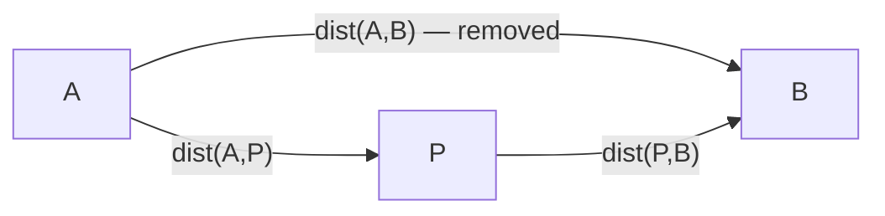
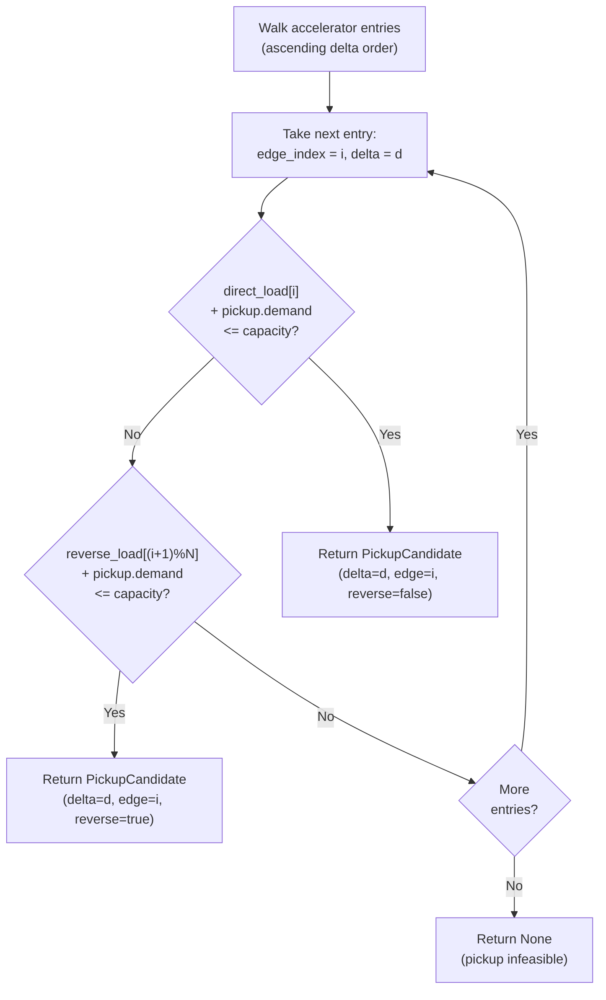

# CoolSolver Pickup Detour Algorithm

The CoolSolver solves a delivery-with-optional-pickup routing problem.
A vehicle departs a depot, delivers packages along a TSP tour, and may
detour through exactly one pickup point if the vehicle has spare capacity.
This document describes the detour decision-making algorithm.

---

## 1. Pipeline overview

1. **Input:** `CoolTspProblem` (depot, deliveries, pickups, vehicle capacity).
2. **Select deliveries:** Trivial knapsack — sort deliveries by demand ascending, add until capacity is exceeded.
3. **Solve TSP:** Run the injected solver over depot plus selected deliveries to get an ordered tour..
4. **Pickup insertion phase** (sections 2–7): Splice a pickup to the computed route. Build detour accelerators, compute load profile over the route, find best feasible pickup detour while checking against the route load profile.
5. **Output:** `CoolTspSolution` (route, nodes, unused_nodes, pickup_detour_delta).

The pickup insertion phase is post-processing only: it does not re-solve the TSP; it splices at most one node into the existing route at the cheapest feasible edge.

---

## 2. Detour geometry

For a route edge connecting node `A` to node `B`, inserting a pickup `P`
replaces the direct edge with a two-leg detour through `P`.



The cost of insertion is:

```
delta = dist(A,P) + dist(P,B) - dist(A,B)
```

By the triangle inequality, `delta >= 0`. A small delta means `P` lies
near the edge `A->B` and the detour is cheap. A large delta means `P`
is far from the edge.

---

## 3. Detour accelerator construction

For each pickup, we precompute deltas for every edge in the route and
sort them. This sorted list is the **accelerator**: it lets us find the
cheapest feasible insertion without re-scanning all edges.

1. **Input:** Pickup `P` and the delivery route (list of `N` nodes).
2. **For each edge** `i` in `0..N-1`: let `A = route[i]`, `B = route[(i+1) mod N]`; compute `delta_i = dist(A,P) + dist(P,B) - dist(A,B)`; append `DetourEntry(delta_i, i)` to a list.
3. **Sort** the list ascending by `delta`.
4. **Output:** The sorted list of `DetourEntry` (cheapest insertion first).

The accelerator includes the closing edge (last delivery node back to
depot). A route of `N` nodes has `N` edges.

**Data structure produced:**

```
accelerator = [
    DetourEntry(delta=0.3, edge_index=4),
    DetourEntry(delta=1.1, edge_index=1),
    DetourEntry(delta=2.7, edge_index=0),
    ...
]
```

Walking this list front-to-back guarantees we consider the cheapest
edge first.

---

## 4. Load profile simulation

The vehicle starts at the depot carrying all packages for the route.
As it visits each delivery node, the load decreases. We simulate this
in both directions independently, because the route is a cycle and can
be traversed either way. We will later select the direction of actual traversal
based on the pickup we decide.

---

## 5. Feasibility check per pickup

Given one pickup's accelerator (sorted by delta ascending) and the load
profile, we find the cheapest edge where the pickup fits.



Because the accelerator is sorted by delta, the first feasible entry is
guaranteed to be the cheapest insertion for this pickup.

---

## 6. Global candidate selection

Each pickup independently produces at most one `PickupCandidate`
(its cheapest feasible insertion). We collect all candidates and pick
the one with the smallest delta globally.

1. **Input:** All pickups, the delivery route, and vehicle capacity.
2. **Compute load profile once** (shared across all pickups).
3. **For each pickup P:** build its detour accelerator (section 3), find best insertion (section 5); if feasible, collect the resulting `PickupCandidate`.
4. **If any candidates:** return the candidate with the smallest `delta`.

This is an `O(P * E)` scan where `P` is the number of pickups and `E`
is the number of edges per route. The load profile is computed once and
reused.

---

## 7. Route insertion and reversal
Splice the pickup at the selected edge, breaking the edge and adding a detour through the pickup point. If the detour was marked `reverse` - reverse the tour traveling direction.
